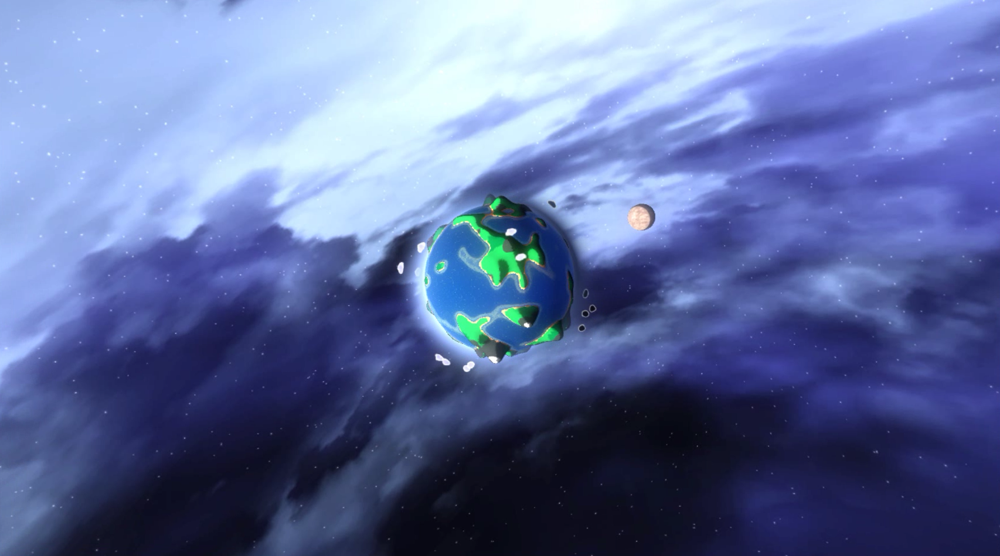
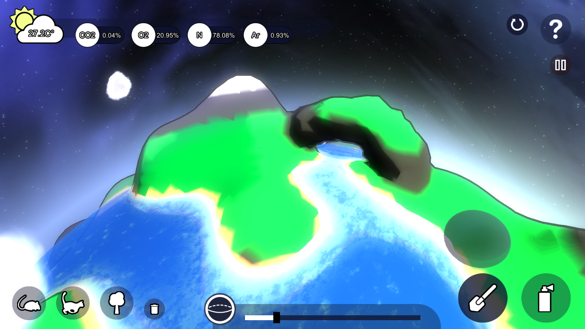

# Planetary-Marching-Cubes
Developed originally for HelloPlanet

Planetary Marching Cubes (PMC) is an algorithm that allows the generation of a smooth sophisticated planet mesh.

When I am still an undergrad student, I have decided that my final year project would be a planet simulating game that could simulate a planet to the best of details for a game. Terrain is one of the key impactors to the simulation. River stems from mountains, plateaus may have a lower temperature and caves is where some animals like bats sleep. Very soon, I started to look into the method common for generating a planet. It seems that previous methods for generating planetary mesh mainly involve using a heightmap. 

Although visually pleasant, the method does not permit the planet to contains features such as caves and cliffhangs. So, I look further in games like ECO. ECO uses a voxel engine to implement a Minecraft-like planet. It also looks very pleasant and allows the features such as caves and overhangs. But, the lack of smooth surfaces disturbs a perfectionist like me XD.

Using marching cubes is a good way to generate a mesh with smooth surfaces and complex features. However, if it is directly used for generating a planet, there will be sampling issues.

So, when I work on my FYP which I name HelloPlanet, I have taken a bit of time investigating on how to write an algorithm that could generate smooth planetary mesh with complex features like caves and overhangs. The result is what I call as Planetary Marching Cubes. Its results are shown below:

A paper has been written for PMC and will be submitted soon. You will be able to find the details there! Likewise, the PMC code will be released soon as well.

You can give HelloPlanet, and therefore PMC a try, by downloading HelloPlanet's EXE (64bits windows only) below:

Normal Version: https://drive.google.com/open?id=0B9fZr1uee_a3dllrdC1rVy1QaUk
VR Version: soon

The EXEs above is only for trial only and is not part of the PMC open source project :) 
